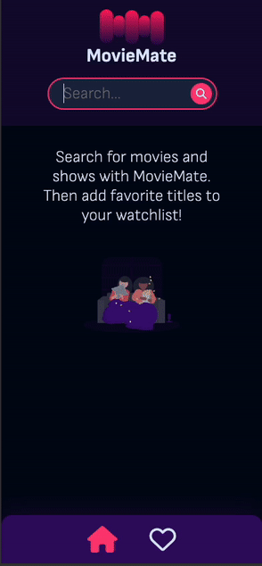

# MovieMate - A Movie Watchlist app

MovieMate is a movie and TV show search discovery web app powered by the Open Movie Database (OMDB) API, built with vanilla JavaScript, CSS, and semantic HTML.

It was built as part of my journey learning async JavaScript, focusing on API interaction, using async-await syntax for handling promises, and try-catch for error handling.

## Table of contents

- [Overview](#overview)
  - [The challenge](#the-challenge)
  - [Demo](#demo)
  - [Links](#links)
- [My process](#my-process)
  - [Built with](#built-with)
  - [What I learned](#what-i-learned)
  - [Continued development](#continued-development)
  - [Useful resources](#useful-resources)
- [Author](#author)

## Overview

### The challenge

Fetch movie and TV show data from the [Open Movie Database (OMBD) API](https://www.omdbapi.com/), display the search results, and allow users to save titles to their watchlist using local storage.

### Demo

<div style="display: flex; gap: 2em;">
  
  
</div>

### Links

- Live Site URL: [MovieMate](https://movie-mate-webapp.netlify.app/)

## My process

### Built with

- Semantic HTML5 markup
- Async JavaScript
- Nested CSS
- Flexbox
- CSS Grid
- JavaScript classes
- Mobile-first workflow

### What I learned

#### async-await

Async-await syntax was put into practice for this project to make asynchronous code look more synchronous when working with promises, along with try-catch for error handling:

```js
async function getCompleteFilmDetails(imdbID) {
  try {
    const response = await fetch(
      `/.netlify/functions/fetchDetailedResultAPI?imdb_id=${imdbID}`
    );

    const data = await response.json();

    if (data.Response === 'False') {
      throw new Error(`Could not get film details for search ID: ${imdbID}`);
    }

    return data;
  } catch (err) {
    console.error(`Error getting film details: ${err}`);
  }
}
```

#### JavaScript classes

In order to make the codebase more DRY, I created a Media class. The Movie and Series classes inherit from the Media class, providing customization of the properties and methods while retaining some of the properties of the parent Media class due to inheritance. I create class methods to handle creation of HTML strings for dynamic insertion into the DOM. This is about as close to React components as I could get considering I had not learned React at this point in my journey.

```js
export default class Movie extends Media {
  constructor(obj) {
    super(obj);
    this.Dvd = obj.DVD;
    this.BoxOffice = obj.BoxOffice;
    this.Production = obj.Production;
    this.Website = obj.Website;
  }

  createResultHtml() {
    const article = this.#createBasicElement('article', this.imdbID, 'result');

    // Use placeholder image for instances where poster is N/A
    if (this.Poster === 'N/A') {
      this.Poster = './assets/imgholdr-image.png';
    }

    article.innerHTML = `
          <picture>
              <source srcset="${this.Poster}" type="image/png">
              
          </picture>
          <div class="result__details">
              <h2 class="result__title">${this.Title} (<time datetime="${
      this.Year
    }">${this.Year}</time>)</h2>
              <span class="result__type">${this.Type} 
                  <time class="result__runtime" datetime="PT${
                    this.Runtime.split(' ')[0]
                  }M">${this.Runtime}</time>
              </span>
              <span class="result__genre">${this.Genre}</span>
              <span class="result__rating">
                  <i class="fa-solid fa-star"></i>
                  <span class="result__rating-value">${this.imdbRating}</span>
              </span>
          </div>
          <button class="result__like-btn" type="button">
              <i class="fa-solid ${
                this.liked ? 'fa-heart-circle-minus' : 'fa-heart-circle-plus'
              }" data-imdb-id="${this.imdbID}"></i>
          </button>
      `;

    return article;
  }

  // More class methods here...
}
```

Also created private class methods marked with **#**. This method was only useful within the class itself so it was unnecessary to expose the method externally:

```js
#createBasicElement(tagType = 'div', idName = '', ...classNames) {
    const htmlElement = document.createElement(tagType);
    htmlElement.id = idName;
    htmlElement.classList.add(...classNames);

    return htmlElement;
  }
```

### Continued development

- Adding Firebase authentication (in progress)
- Firebase database for storing user watchlist
- Converting codebase to React

## Author

- [Portfolio](https://www.jeffeng.com)
- X (formerly Twitter) [@elev8eng](https://x.com/elev8eng)
